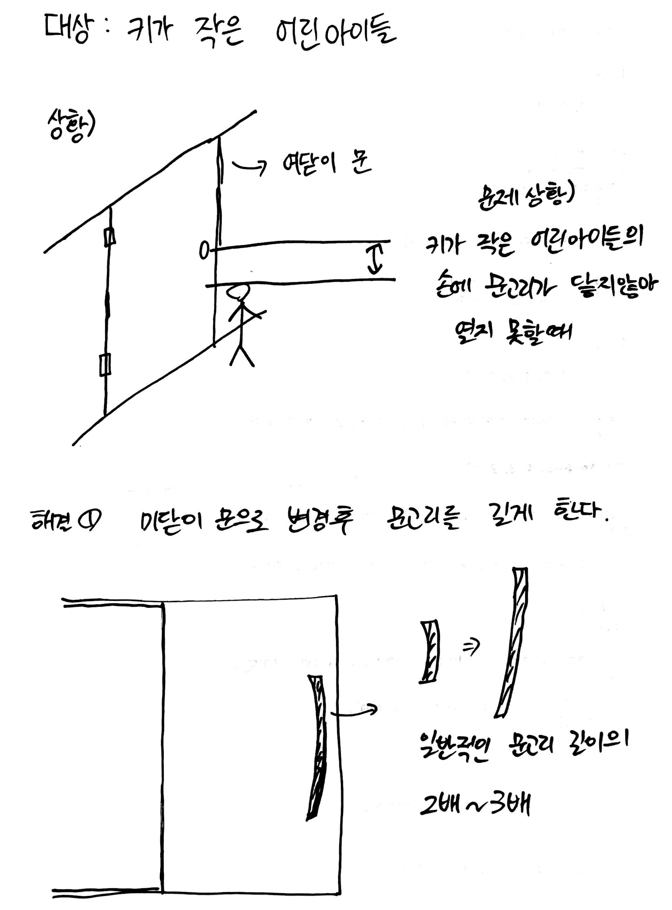
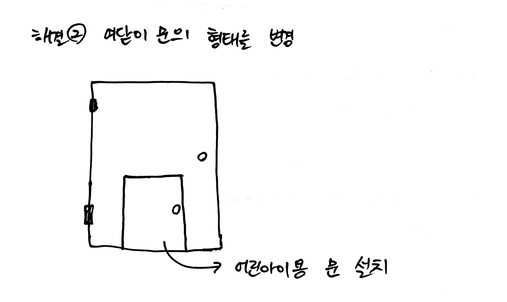

#  UI & UX 특강

> UX 는 User Experience 
>
> > 사용자의 경험을 조사해 문제를 인식하는 과정 (다른사람을 위해 만드는것)
>
> 
>
> UI 는 User Interface
>
> > 사용자 환경 (디지털기기)


``` python

'문화적특성을 고려해야하고, 알려주지않아도 직관적으로 사람들이 사용할수있게하는 행동유도가 중요하다. UX를 고려하여 사용자에게 맞게 제작한다'

```


### 의도,기획,실행

********

=> 앱개발의 기초적인 단계이다.


> 1. **문제를 찾고 조사하기** (중요!!)
>
> 2. 생각을 구체화하기
>
> 3. 해결방안 찾기
>
> 4. 시각화하기


<u>✔모든 과정을 시작하기전에 사용자(타겟유저)를 설정하는것이 중요하고 타겟유저가 원하는 컨텐츠를 찾아야한다. 비록 그것이 비합리적,비효율적일지라도....</u>


### UI & UX 의 중요한 3가지 요소

*****

+ **기능성 & 사용성**

  + 기능성에 주목하느냐 사용성에 주목하느냐에 따라 달라진다

    + ex1) 근대사회에서는 대량생산을 추구했으며 그땐 물건에 장식을 하나 더 넣는것보다 대량생산하기 쉬운 미니멀한 디자인으로 기능성에 더 중점을 두었다. 하지만 우리 선조들은 물건하나를 만들더라도 오랫동안 정성을 들여 아름다운 디자인의 물건을 만드는것을 추구했다. 이것은 사용성에 더 중점을 둔것이다.
    + ex2) 컵을 하나 샀다. 컵은 물 같은 음료를 마시라고 만든 물건임에는 반박할수없을것이다. 이것이 물건을 만든 창조자가 물건에 부여한 기능성이다. 하지만 컵을 구매한 소비자가 컵을 종이위에 올려 문진처럼 사용한다면? 그것은 사용성에 중점을 둔것이다.

    

+ **피드백**

  + 즉각적인 반응이 필요하다. 
    + 예시) `요즘 인터넷방송들 VS 싸이월드` 이렇게 비교해본다면 바로 이해가 갈것이다. 새로운건 없다. 요즘 인터넷 방송들의 소재들은 예전에 싸이월드에서도 있던 소재들일것이다. 그러나 지금과는 뭐가 다른가? 요즘의 인터넷방송들은 실시간 채팅을 통해 시청자와 즉각적인 소통을 한다. 시청자로 하여금 마주보고 말하는것과 같은 느낌을 받게 할수있다.
  + 즉각적인 반응에대한 적용, 반성

  

+ **의미의 전달**

  + 우리는 `정보의 홍수` 속에서 살고있다. 우리에게 정보는 이미 많으니 이제 그것을 얼마나 잘 찾고 활용하는지가 중요하다.

  + 다양한 리서치 과정을 통해서 의미있는 정보를 캐내야한다.

    + 의미를 캐내는 과정은 스토리, 스토리텔링이 중요하다. 서비스는 사람을 감동시켜야한다.

      + 유머와 재미,감동으로 인간적인 감성에 어필해야한다.

        > -문학의 이해-
        >
        > 주장하기위해서는 근거를 대지만,
        >
        > 느낌을 전달하려면 인간성을 입증해야한다.


### 문고리 디자인해보기

****

1. 특별한 상황을 설정하고
2. 사용자의 행동을 인식하고
3. 적합한 디자인을 시행한다








**(설명)**

내가 정한 <u>타겟유저</u>는 문고리에 손이 닿지 않을만큼 <u>키가 작은 어린아이들</u>이다. 어린아이들은 문고리에 손이 안닿아 발꿈치를 들어올려 시도하지만 그마저도 잘 안되는 경우를 여러번 봤다. 그래서 생각해본것이 만약 집의 문이 <u>여닫이</u> 라면 문의 밑에 부분쪽에 어린아이들이 드나들수있는 사이즈로 잠금장치나 걸쇠없이 문고리로 밀기만 해도 열리는문을 생각해봤다[^1].  그리고 만약 문이 <u>미닫이</u>인 경우엔 그냥 손잡이의 길이만 긴걸로 바꿔줘도 어린아이 혼자 문을 열기 충분할것이라 생각한다[^2].


### 아이디어 도출하기

*****

+ **문화콘텐츠**
  + 재미있는 `문화`적인 요소를 `디지털매체`를 통해 사람들에게 전달하여 `상업적 이윤`을 창조하는것.


+ 스마트 문화콘텐츠
  + `스마트 기기 + 문화콘텐츠`를 말한다.
  + 수평적구조와 `아이디어`가 핵심이다


*******

[^1]: 해결 2번 그림 참고!
[^2]: 해결 1번 그림 참고!

